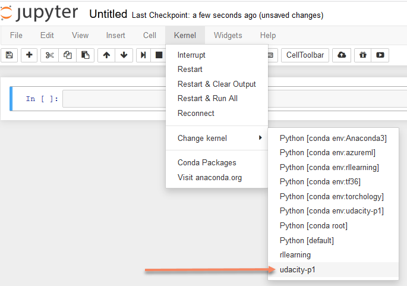

[//]: # (Image References)

[image1]: https://user-images.githubusercontent.com/10624937/42135619-d90f2f28-7d12-11e8-8823-82b970a54d7e.gif "Trained Agent"

# Udacity Banana collector

### Introduction

This project has been built for the [Udacity Deep Reinforcement Learning Nano Degree Program](https://eu.udacity.com/course/deep-reinforcement-learning-nanodegree--nd893).
With this you can train an agent to navigate and collect bananas in a large, square world.

![Trained Agent][image1]

### Project Details

The goal is to collect as many yellow bananas available while avoiding blue bananas.

The agent is trained using an algorithm called Deep Q-Learning. Deep Q-Learning combines the best of reinforcement learning with recent advances in deep learning. For details see the [jupyter notebook](./Report.ipynb) provided with this repository. 

The environment for training the agent provided is an adapted version of the [Banana Collector](https://github.com/Unity-Technologies/ml-agents/blob/master/docs/Learning-Environment-Examples.md#banana-collector) provided by the [Unity ml-agents library](https://github.com/Unity-Technologies/ml-agents)

The state space has 37 dimensions and contains the agent's velocity, along with ray-based perception of objects around agent's forward direction.  Given this information, the agent has to learn how to best select actions.  Four discrete actions are available, corresponding to:
- **`0`** - move forward.
- **`1`** - move backward.
- **`2`** - turn left.
- **`3`** - turn right.

The task is episodic, and in order to solve the environment, the agent must get an average score of +13 over 100 consecutive episodes.

### Getting Started

1. Clone this repository, and navigate to the `udacity-p1/` folder.  Then, install several dependencies.
```bash
git clone https://github.com/primeMover2011/udacity-p1.git
cd udacity-p1
```

2. Download the environment from one of the links below.  You need only select the environment that matches your operating system:
    - Linux: [click here](https://s3-us-west-1.amazonaws.com/udacity-drlnd/P1/Banana/Banana_Linux.zip)
    - Mac OSX: [click here](https://s3-us-west-1.amazonaws.com/udacity-drlnd/P1/Banana/Banana.app.zip)
    - Windows (32-bit): [click here](https://s3-us-west-1.amazonaws.com/udacity-drlnd/P1/Banana/Banana_Windows_x86.zip)
    - Windows (64-bit): [click here](https://s3-us-west-1.amazonaws.com/udacity-drlnd/P1/Banana/Banana_Windows_x86_64.zip)
    
    (_For Windows users_) Check out [this link](https://support.microsoft.com/en-us/help/827218/how-to-determine-whether-a-computer-is-running-a-32-bit-version-or-64) if you need help with determining if your computer is running a 32-bit version or 64-bit version of the Windows operating system.

    (_For AWS_) If you'd like to train the agent on AWS (and have not [enabled a virtual screen](https://github.com/Unity-Technologies/ml-agents/blob/master/docs/Training-on-Amazon-Web-Service.md)), then please use [this link](https://s3-us-west-1.amazonaws.com/udacity-drlnd/P1/Banana/Banana_Linux_NoVis.zip) to obtain the environment.

3. Extract the contents of the file to a folder of you choice, preferably as a subfolder of this repository.

4. Install [conda](https://conda.io/en/latest/miniconda.html) 
5. cd in to the directory where you cloned this repository, create a virtual environment and install the required python packages using these commands

```bash
cd udacity-p1
conda env create -f environment.yml
```

activate the environment using

```bash
conda activate udacity-banana
```

6. Create an [IPython kernel](http://ipython.readthedocs.io/en/stable/install/kernel_install.html) for the `udacity-p1` environment.  
```bash
python -m ipykernel install --user --name udacity-p1 --display-name "udacity-p1"
```
5. Before running code in a notebook, change the kernel to match the `udacity-p1` environment by using the drop-down `Kernel` menu. 



6. Open [the notebook Report.ipynb](./Report.ipynb) and execute each cell to train an agent using Deep Q-Learning with a Dueling network.

Enjoy!


